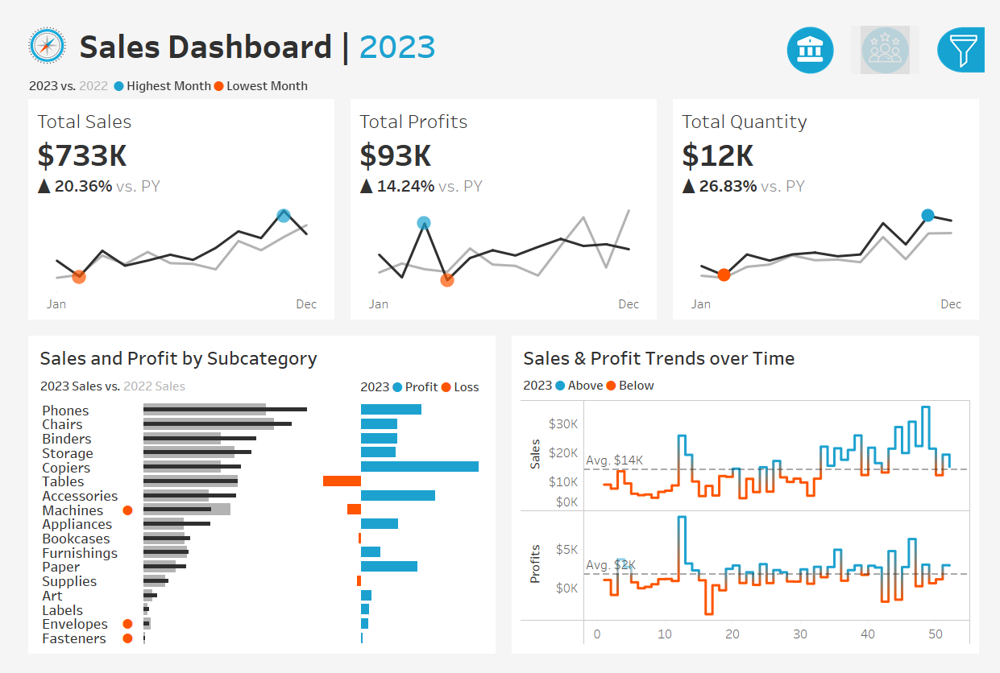

#  Sales Dashboard Visualization Project | Tableau

This project presents an interactive and insightful **Sales Dashboard** built using **Tableau**, designed to help stakeholders monitor business performance, uncover trends, and explore key metrics across time, products, and regions.

---
## Datasets

All cleaned datasets used in this project are available in the [`datasets/`](https://github.com/sanjanamarri2521/Sales_Dashboard_Visualization_Project/tree/main/datasets) folder of project repository.

---

##  Objectives

The goal of this dashboard is to:

- Visualize overall sales, profits, and quantities sold  
- Compare monthly sales, profits, and quantities between the current and previous year  
- Identify high and low performing product categories  
- Analyze trends over time and compare with historical benchmarks  
- Enable interactive filtering across various dimensions

---

##  Dashboard Visuals

###  Without Filters Panel

###  With Filters Panel Open

---

##  Dashboard Features

### 1. Time-Based KPI Tracking
- Monthly trendlines for Sales, Profit, and Quantity  
- Side-by-side comparison of current year vs previous year  
- Visual highlights for highest and lowest performing months

### 2. Product Subcategory Insights
- Comparative sales view (current vs previous year)
- Profitability analysis showing gainers vs loss-makers

### 3. Weekly Sales & Profit Trends
- Above/below average benchmarks
- Patterns to reveal seasonal shifts and anomalies

### 4. Interactive Filtering
- Filter by:
  - Year  
  - Product Category and Sub-Category  
  - Region, State, and City  
- Panel-based filter design for intuitive exploration

---

##  Tools & Technologies

- **Tableau Desktop / Tableau Public**  
- **Microsoft Excel / CSV for data handling**  
- **GitHub** for version control and documentation

---

## Learning Outcomes

This project demonstrates the ability to:

- Design interactive Tableau dashboards with clear KPIs  
- Explore business data across time and categories  
- Apply dynamic filters for multidimensional analysis  
- Translate raw metrics into visual business stories

---

##  Acknowledgment

Special thanks to **Baraa Khatib Salkini** (YouTube: *Data with Baraa*) whose guidance through the tutorial *“Tableau Complete Project End-to-End | Like I Do in My Real Projects”* helped shape this analysis approach.

---

## Acknowledgments

Special thanks to **Baraa Khatib Salkini**, an IT professional and YouTuber with channel [Data with Baraa](https://www.youtube.com/@DatawithBaraa), whose video tutorial [**"Tableau Complete Project End-to-End | Like I Do in My Real Projects"**](https://www.youtube.com/watch?v=dahrmqT5GD4&list=PLNcg_FV9n7qZ4Ym8ZriYT6WF8TaC2e_R7&index=3) provided valuable guidance throughout the development of this project.

---

## License

This project is licensed under the MIT License. See the [LICENSE](LICENSE) file for details.

