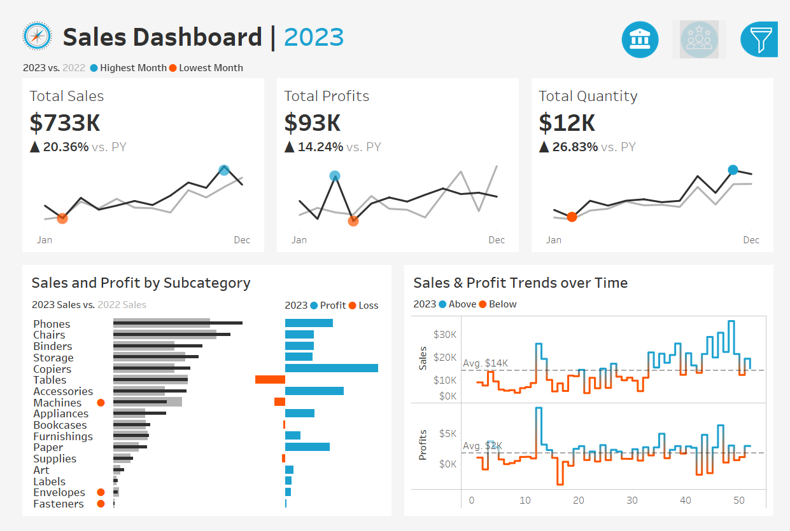
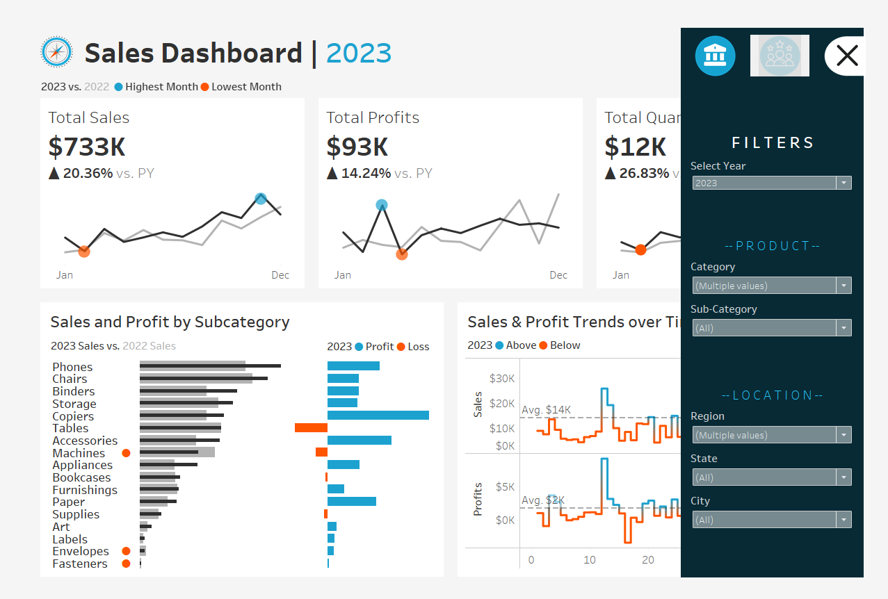
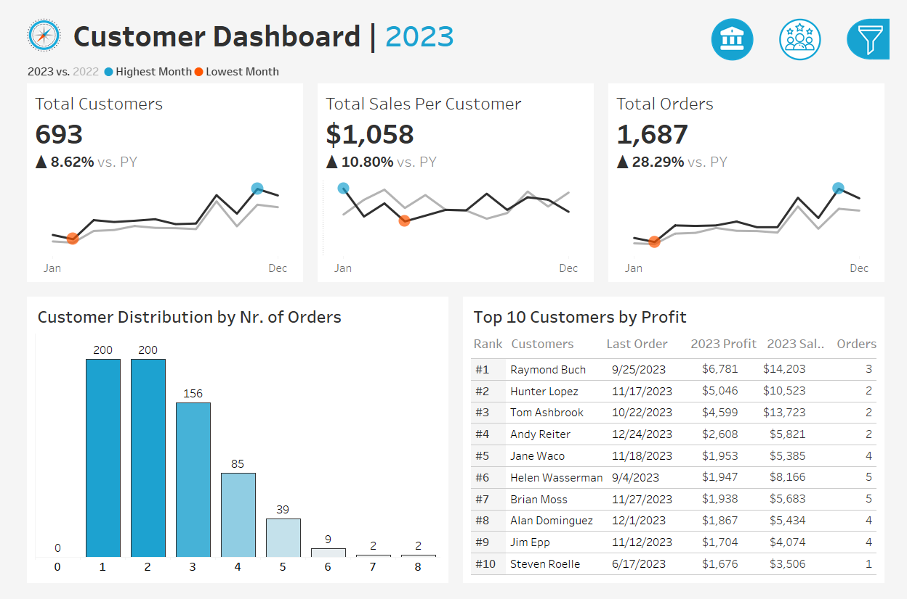
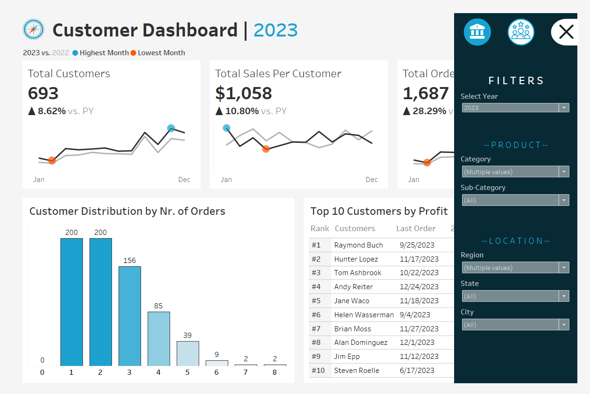

#  Sales & Customer Dashboard Visualization Project | Tableau

This project presents a set of interactive dashboards built using **Tableau**, designed to provide powerful business insights into sales and customer behavior. The dashboards offer intuitive navigation, time-based trends, profitability analysis, and top-performer breakdowns—all in a sleek, interactive design.

 **[View the Tableau Dashboard on Tableau Public](https://public.tableau.com/app/profile/sanjana.marri7771/viz/SalesDashboard_17510166613430/SalesDashboard?publish=yes)**

---

##  Objectives

- Visualize overall sales, profits, and quantities sold  
- Compare monthly metrics between current and previous year  
- Understand customer distribution, behavior, and profitability  
- Identify top-performing product categories and customers  
- Provide a seamless filter experience across dashboards

---

##  Dashboard Visuals

###  Sales Dashboard (No Filters Panel)

###  Sales Dashboard (With Filters Panel Open)

---

###  Customer Dashboard (No Filters Panel)

###  Customer Dashboard (With Filters Panel Open)

---

##  Dashboard Features

### 1.  Seamless Navigation
- Two dashboards: **Sales** and **Customer**
- Linked through **shared filters**:
  - Year  
  - Product Category & Subcategory  
  - Region, State, City  
- Allows consistent context when switching between dashboards

### 2.  Sales Dashboard Highlights
- KPIs: Total Sales, Profits, Quantity (YoY growth)
- Monthly trends comparing current vs previous year
- Subcategory breakdown with profit/loss bars
- Sales & profit trendlines with average benchmarks

### 3.  Customer Dashboard Highlights
- KPIs: Total Customers, Orders, Sales per Customer
- Monthly customer and order trends vs previous year
- Distribution of customers by number of orders
- Top 10 customers by profit, sales, and activity

---

##  Tools & Technologies

- **Tableau Desktop / Tableau Public**  
- **Microsoft Excel / CSV for data handling**  
- **GitHub** for version control and documentation

---

##  Learning Outcomes

This project demonstrates the ability to:

- Create connected dashboards with shared filters  
- Design for both executive KPIs and detailed drilldowns  
- Extract actionable insights using visuals and interactivity  
- Combine product and customer intelligence for business impact 
- Apply dynamic filters for multidimensional analysis  
- Translate raw metrics into visual business stories

---

##  Acknowledgment

Special thanks to **Baraa Khatib Salkini** (YouTube: *Data with Baraa*) whose guidance through the tutorial *“Tableau Complete Project End-to-End | Like I Do in My Real Projects”* helped shape this analysis approach.

---

## Acknowledgments

Special thanks to **Baraa Khatib Salkini**, an IT professional and YouTuber with channel [Data with Baraa](https://www.youtube.com/@DatawithBaraa), whose video tutorial [**"Tableau Complete Project End-to-End | Like I Do in My Real Projects"**](https://www.youtube.com/watch?v=dahrmqT5GD4&list=PLNcg_FV9n7qZ4Ym8ZriYT6WF8TaC2e_R7&index=3) provided valuable guidance throughout the development of this project.

---

## License

This project is licensed under the MIT License. See the [LICENSE](LICENSE) file for details.

